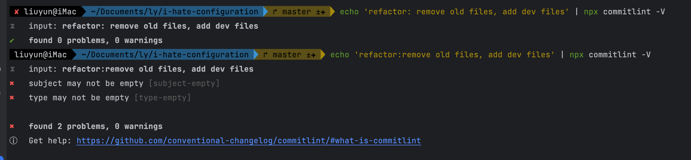

<h1>Commitlint</h1><p>v17.6.7</p>

[github](https://github.com/conventional-changelog/commitlint)


## 介绍

Commitlint 是一个检查 Git 提交信息格式是否符合约定式提交规范的工具，可以规范化提交信息格式，使得代码仓库更加清晰和易于管理

Commitlint 的本质是一个 Node.js 模块，它提供了一个命令行工具。结合 husky，可以在 git commit 之前对提交信息进行验证。通过配置规则文件，可以设置各种校验条件。

除此之外，还可以使用正则表达式进行更复杂的校验。如果提交信息不符合规则，Commitlint 将会提示错误信息，阻止提交操作。

<br/>

使用 commitlint 时，需要安装以下两个依赖

```
pnpm add @commitlint/cli @commitlint/config-conventional -D
```

@commitlint/cli 是 Commitlint 命令行工具，它可以从终端读取 Git 提交信息，并根据配置文件进行校验，是与 commitlint 交互的主要方式。

> 它内部实现了一个 [gitRawCommits](https://github.com/conventional-changelog/conventional-changelog/blob/master/packages/git-raw-commits/index.js) 方法，通过调用 `git log` 命令来读取仓库的 git 提交信息

@commitlint/config-conventional 是一个预设的规则（基于 Angular）配置文件，其中包括了一些常见的提交类型、范围等基础规则，以及针对这些规则的错误消息。

在@commitlint 仓库下还有其他一些共享的配置：

- [@commitlint/config-angular](https://github.com/conventional-changelog/commitlint/blob/master/@commitlint/config-angular)
- [@commitlint/config-conventional](https://github.com/conventional-changelog/commitlint/blob/master/@commitlint/config-conventional)
- [@commitlint/config-lerna-scopes](https://github.com/conventional-changelog/commitlint/blob/master/@commitlint/config-lerna-scopes)
- [@commitlint/config-nx-scopes](https://github.com/conventional-changelog/commitlint/blob/master/@commitlint/config-nx-scopes)
- [@commitlint/config-patternplate](https://github.com/conventional-changelog/commitlint/blob/master/@commitlint/config-patternplate)
- [conventional-changelog-lint-config-atom](https://github.com/erikmueller/conventional-changelog-lint-config-atom)
- [conventional-changelog-lint-config-canonical](https://github.com/gajus/conventional-changelog-lint-config-canonical)
- [commitlint-config-jira](https://github.com/Gherciu/commitlint-jira)

## 简单用法

命令行创建

```
echo "module.exports = {extends: ['@commitlint/config-conventional']}" > commitlint.config.js
```

或者手动在项目根目录下创建 `commitlint.config.cjs` 内容如下：

```js
module.exports = {
  extends: ["@commitlint/config-conventional"],
};
```

这样就完成了配置，表示在项目中使用 @commitlint/config-conventional 提供的配置作为提交消息的模板。

为了能正常触发 commitlint 对提交消息进行检查，一般会与 husky 共同使用，在 commit-msg 这个 git hook 时触发 @commitlint/cli 对提交的消息进行校验。

```
npx husky add .husky/commit-msg  'npx --no -- commitlint --edit "$1"'
```

或者在 ./husky/ 目录下创建 commit-msg 文件，内容如下

```ini
#!/usr/bin/env sh
. "$(dirname -- "$0")/_/husky.sh"

npx --no -- commitlint --edit "$1"
```

到此就完成了配置，在执行 `git commit -m "xxx"` 操作时，就会触发对消息的检查，符合 @commitlint/config-conventional 预设的规范时才会被提交，不符合时，中终提交，并根据格式中的问题返回预设中配置的报错信息。

> 通过这个命令，可以在控制台测试一下配置是否正常：`echo 'refactor:remove old files, add dev files' | npx commitlint -V `

_提交示例_



## 配置项

从官网以及仓库中的预设，可以看出 commitlint.config.cjs 的完整配置如下

### extends

继承一个或多个预设规则，例如 @commitlint/config-conventional，也可以指定自定义配置文件路径：

- 可以是以 commitlint-config- 为前缀的依赖包，如：commitlint-config-lerna
- 作用域包，直接写命名，如：@commitlint/config-conventional
- 本地配置文件地址：`'./commitlint.base.js'`

```js
module.exports = {
    extends: [
        'lerna' // prefixed with commitlint-config-*,
        '@commitlint/config-conventional' // scoped packages are not prefixed
    ]
  	// 本地配置
  	extends: ['./commitlint.base.js', './commitlint.types.js'],
}
```

在每个预设配置里，都配置了关键的配置项，比如 parserPreset、rules、prompt这些选项。

<br/>

### parserPreset ⬇️ ❓

指定解析器预设，以便正确地解析和分析提交消息，可以使用 commitlint 内置的，也可以是一个自定义的解析器预设。

每种提交规范所使用的消息格式有所不同，所以需要对应的解析器对消息内容按模板进行解析，才能对消息进行检查。在每个解析器预设的下的 templates 目录里，有几个 `.hbs` 格式的文件，就是该种规范所对应的格式模板。

> .hbs 文件是一种使用 Handlebars 模板引擎语法编写的模板文件，通常用于网页开发中生成动态 HTML 页面。
>
> Handlebars 是一个基于 Mustache 模板（Vue 也使用了该语法）语言的扩展，它允许开发者在静态 HTML 页面中嵌入动态内容。

像上面用到的 @commitlint/config-conventional 预设配置中，其中指定的解析器预设是 [conventional-changelog-conventionalcommits](https://github.com/conventional-changelog/conventional-changelog/blob/master/packages/conventional-changelog-conventionalcommits/README.md)，这是 commitlint 内置的一个份配置，是前面说到的约定式提交规范 [Conventional Commits](https://www.conventionalcommits.org/zh-hans/v1.0.0/) 的具体实现。

Commitlint 内置了多种解析器预设，在源码仓库的 `/packages` 目录下，可以根据不同的提交信息格式规范进行选择。还有一些 parserPreset：

- [conventional-changelog-angular](https://github.com/conventional-changelog/conventional-changelog/blob/master/packages/conventional-changelog-angular/README.md)：
- [conventional-changelog-atom](https://github.com/conventional-changelog/conventional-changelog/blob/master/packages/conventional-changelog-atom/README.md)：
- [conventional-changelog-eslint](https://github.com/conventional-changelog/conventional-changelog/blob/master/packages/conventional-changelog-eslint/README.md)：
- [conventional-changelog-express](https://github.com/conventional-changelog/conventional-changelog/blob/master/packages/conventional-changelog-express/README.md)：

<br/>

### rules

设置具体规则，例如提交消息的长度、格式、类型等，格式为：

```js
// 数组
"rule-name": [Level,Applicable,Value]

// 返回数组的函数
"rule-name": () => [Level,Applicable,Value]

// async 风格
"rule-name": async () => [Level,Applicable,Value]

// Promise 风格
"rule-name": () => Promise resolve([Level,Applicable,Value])
```

- rule-name：规则名称，需要遵循预设的规则，获取所有规则名称可以查看[官网](https://commitlint.js.org/#/reference-rules?id=available-rules)
- Level：0-禁用，1-警告，2-错误
- Applicable：`always` - 正匹配， `never` - 反匹配，类似"取反"
- Value：用于此规则的值，可以为`number/string/array`等类型

例如：`"body-full-stop": [0,'never','.']`，表示的意思是：提交的`commit message`不能以字符`.`结尾

每个预设规范中都有一些共同的基础规则，例如 `type-case`、`subject-max-length`等。同时，不同的预设规范也可能具有一些独有的规则，用于满足特定的项目需求。

这里比较重要的规则是 `type-enum`，它定义了可以提交哪些类型，默认值有 `['feat', 'fix', 'docs', 'style', 'refactor', 'test', 'revert']` 这 7 种，在 @commitlint/config-conventional 这份配置中，定义如下：

```js
'type-enum': [
			2,
			'always',
			[
				'build',
				'chore',
				'ci',
				'docs',
				'feat',
				'fix',
				'perf',
				'refactor',
				'revert',
				'style',
				'test',
			],
		],
```

根据这个规则配置，可以当前 commitlint 允许提交哪些类型

<br/>

### prompt

提示用户输入自定义提交消息

### formatter ⬇️ ❓

指定错误消息格式化程序，可以是 '@commitlint/format-xxx'，也可以是一个自定义的格式化程序

### ignores

忽略检查的文件路径或者正则表达式；

### defaultIgnores

是否默认忽略某些文件，例如 node_modules 等

### helpUrl
