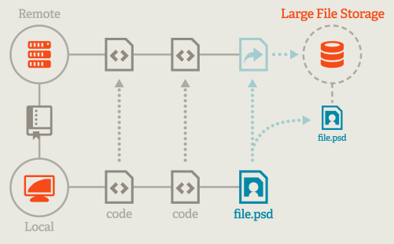

<h1>Git LFS</h1>

[官方文档](https://git-lfs.com/)


## 介绍

Git 是业界流行的分布式版本控制工具，本地仓库与远端仓库同样保存了全量的文件和变更历史，这样让代码协作变得简单和高效。但也正因为如此，Git针对大型文件（例如图片、视频或其他二进制文件）的版本控制，也会存在一些问题，主要有两点：

- 效率变慢：不管实际上用户是否使用到这些大文件的历史，都需要把每一个文件的每一个版本下载到本地仓库。毫无疑问，下载耗时的增加给用户带来了更多的等待时间。
- 空间变大：一个Git仓库存放的大型的文件越多，加之伴随着其关联提交不断增多，Git仓库会以非常快的速率膨胀，占用更多的磁盘空间。

<br/>

Git LFS（Git Large File Storage）是 Git 的一个扩展，旨在更**有效地处理大型文件**，它将音频、视频、数据集和图形等大型文件替换为 Git 中的文本指针（引用和元数据），同时将文件内容单独存储在远程服务器（如 GitHub.com 或 GitHub Enterprise）上。这使得Git仓库能够更快速地克隆、推送和拉取，同时有效地处理大型媒体文件、二进制文件等。

<br/>

**优势和适用场景**

- 更快的操作速度：由于只需处理文件的引用，Git LFS使得Git仓库的克隆、推送和拉取操作更加迅速
- 有效管理大型文件：对于大型媒体文件、二进制文件等，Git LFS提供了一种高效的版本控制方式，减小了仓库的体积。
- 团队协作：锁定文件的功能使得团队能够更好地协同工作，防止冲突


## 工作原理

**普通场景**

不论是针对小型的代码文本文件、还是比较大型的图片文件，在相关变更从本地提交到远端仓库时，所有的相关文件资源都会完整的存储在git server。就图片中的例子而言，如果图片文件越来越多，改动频次越来越大，仓库的体积将极速膨胀起来。

<br/>

**Git LFS 场景**

如下图所示，我们可以针对jpg图片使用Git LFS的存储能力，在push过程中将其上传至大文件存储服务。同时，大文件对应的指针文件将连同其他的普通的代码文件推送到远端Git仓库中。




## 安装

以官网为准

**Windows**

目前lfs已经集成在了Git for Windows 中，直接下载和使用最新版本的Windows Git即可。

**mac**

```shell
# 下载
brew install git-lfs
# 安装
git lfs install
```

也可以按照下面的方法安装

**Linux**

下载二进制包：https://link.zhihu.com/?target=https%3A//github.com/git-lfs/git-lfs/releases

直接执行解压后的./install.sh脚本即可，这个脚本会做两个事情：

在$PATH中安装Git LFS的二进制可执行文件

执行`git lfs install`命令，让当前环境支持全局的LFS配置


## 初始配置

1、初始化

下载并安装 git lfs 后，执行以下命令，为帐户设置 Git LFS：

```shell
git lfs install
```

每个用户帐户只需运行一次

<br/>

2、设置跟踪大文件

在要使用 Git LFS 的 Git 存储库中，选择希望 Git LFS 管理的文件类型，执行以下命令：

```shell
git lfs track "*.zip"
```

track 命令实际上是修改了仓库中的.gitattributes文件，它会在`.gitattributes`文件中增加如下信息：

```ini
*.zip filter=lfs diff=lfs merge=lfs -text
```

这告诉Git LFS来跟踪所有 `.zip`文件，你可以使用通配符或者指定特定的文件名。

所以在设置之后，为了让它生效，应该提交已经发生变更的`.gitattributes`文件

也可以通过直接编辑` .gitattributes`文件来设置要跟踪的大文件

**注意**

定义 Git LFS 应跟踪的文件类型，并不会将已经存在的文件转换为 Git LFS，例如其他分支或先前提交历史记录中的文件。为此，请使用` git lfs migrate`命令，该命令具有一系列旨在适应各种潜在用例的选项。

<br/>

3、经过上面操作，就已经配置好了仓库的 git lfs，对指定的文件开启了大文件追踪，后续像正常情况一样提交代码即可，Git LFS 将自动处理大文件的上传和下载。


## 常用操作

### 新增跟踪

要使用Git LFS跟踪大文件，你需要使用`git lfs track`命令。例如：

```shell
git lfs track "*.zip"
```

<br/>

### 查看已跟踪的文件列表

执行`git lfs track`（不带任何参数），可以查看当前已跟踪的Git LFS File 类型：

```sh
git lfs track

# 展示当前已跟踪的Git LFS File 类型或文件
Listing tracked patterns
    *.bigfile (.gitattributes)
    *.exe (.gitattributes)
    *.zip (.gitattributes)
Listing excluded patterns
```

<br/>

### 撤销跟踪

取消继续跟踪某类文件，并将其从cache中清理：

```shell
git lfs untrack "*.zip"
git rm --cached "*.zip"
```

如果你想将这些文件添加回常规 Git 跟踪，可以执行以下操作：

```shell
git lfs track "*.zip"

git commit -m "重新添加.zip lfs配置"
```

<br/>

### 锁定和解锁文件

通过git lfs lock命令，你可以锁定大文件，以防止其他人修改它们。解锁文件允许其他人继续修改文件。

```shell
git lfs lock some_large_file.jpg
git lfs unlock some_large_file.jpg
```

<br/>

### 查看LFS信息

使用以下命令可以查看有关LFS的信息：

```shell
git lfs ls-files
git lfs status
```

这些命令提供了有关跟踪文件的详细信息，包括文件的大小和当前状态。


## 问题

```
Remote "origin" does not support the Git LFS locking API. Consider disabling it with:
  $ git config lfs.https://github.com/yun8711/fe-engineering.git/info/lfs.locksverify false
Post "https://github.com/yun8711/fe-engineering.git/info/lfs/locks/verify": EOF
error: failed to push some refs to 'https://github.com/yun8711/fe-engineering.git'
```

这个错误是因为你的 Git LFS 锁定 API 没有被远程仓库 "origin" 支持。Git LFS 锁定 API 是一个可选的特性，它允许你在修改大文件时锁定它们，以防止其他人同时修改。  

当你尝试推送到一个不支持这个特性的远程仓库时，就会出现这个错误。在这种情况下，你可以考虑禁用 Git LFS 锁定 API。按照提示，通过运行以下命令来禁用它

```
git config lfs.https://github.com/yun8711/fe-engineering.git/info/lfs.locksverify false
```

然后再次提交即可
