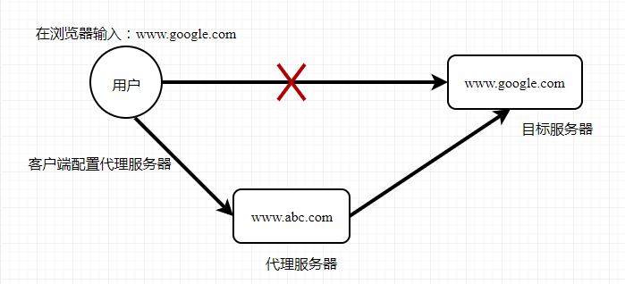
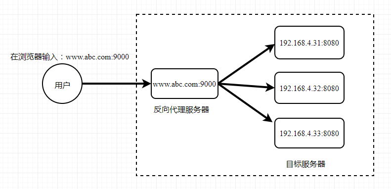
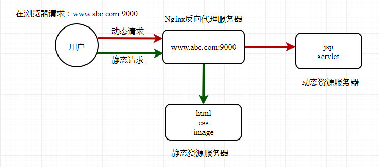

# Nginx 配置示例


## 正向代理

一般的访问流程是客户端直接向目标服务器发送请求并获取内容，使用正向代理后，客户端改为向代理服务器发送请求，并指定目标服务器（原始服务器），然后由代理服务器和原始服务器通信，转交请求并获得内容，再返回给客户端。

正向代理的**代理对象是客户端**，即替客户端去访问目标服务器，使真实客户端对服务器不可见；

比如 VPN，你的浏览器无法直接访问谷歌，这时候可以通过一个代理服务器来帮助你访问谷哥，那么这个服务器就叫正向代理。



*示例*

```ini
server {
	  # 指定DNS服务器IP地址 
    resolver 8.8.8.8;
    # 监听浏览器请求的端口号
    listen 80;
		# 接收到被代理浏览器发来的请求之后，需要执行的请求是什么
    location / {
    		# 指明目的主机和uri，一般不需要修改
        proxy_pass http://$http_host$request_uri;
    }
}
```

在需要访问外网的客户端上执行以下一种操作即可：

```sh
1. 方法1（推荐）
export http_proxy=http://你的正向代理服务器地址：代理端口   

2. 方法2
vim ~/.bashrc
export http_proxy=http://你的正向代理服务器地址：代理端口   
```

然后在客户端（浏览器）中访问 `https://www.google.com`时，不再是直接去访问该地址，它会被代理服务器“劫持”，代理服务器按照 server 中的配置重新请求，并返回请求到的内容


## 反向代理

与一般访问流程相比，使用反向代理后，直接收到请求的服务器是代理服务器，然后将请求转发给内部网络上真正进行处理的服务器，得到结果再返回给客户端。反向代理**隐藏了真实的服务器**，为服务器收发请求，使真实服务器对客户端不可见。一般在处理跨域请求的时候比较常用。现在基本上所有的大型网站都设置了反向代理。

反向代理指代理后端服务器响应客户端请求的一个中介服务器，代理的对象是服务端。



简单的说，一般**给客户端做代理的都是正向代理，给服务器做代理的就是反向代理**。

*示例 1：浏览器访问时，从 nginx 服务器跳转到 linux 系统 tomcat 主页面*

```ini
    server {
        listen       80; 
        #监听地址
        server_name  192.168.4.32;   
   
        location  / { 
        	 # 请求资源的根目录
           root html;  
           # 请求转向
           proxy_pass http://127.0.0.1:8080; 
           # 设置默认页
           index  index.html index.htm;             
        } 
    }
```

*示例 2：根据输入的路径不同，跳转到不同端口的服务中*

```ini
    server {
        listen       9000;   
        server_name  192.168.4.32;   #监听地址       
        
        location  ~ /example1/ {  
           proxy_pass http://127.0.0.1:5000;         
        } 

        location  ~ /example2/ {  
           proxy_pass http://127.0.0.1:8080;         
        } 
    }
```

注意：`location  ~ /example2/`表示访问 `192.168.4.32/example2` 时会被转发到 `http://127.0.0.1:8080;`对应的服务上，在项目中，必须有全局前缀 `/example2/`，否则访问不到项目中，这个配置有点像前端构建时的 publicPath 选项。


## 负载均衡

负载均衡是一种技术，可以在多个服务器之间分配网络流量，以提高网站、应用、数据库或其他服务的性能、可靠性和可扩展性。负载均衡的主要目标是**优化资源使用，最大化吞吐量，最小化响应时间，同时避免任何单一资源的过载**。

实现负载均衡的方式：

- 硬件负载均衡：一种专用的硬件，如负载均衡器，用于分发网络流量到多个服务器。硬件负载均衡器通常具有**高性能和高可用性，但成本较高**
- 软件负载均衡：一种在服务器上运行的软件，可以将网络流量分发到多个服务器。软件负载均衡器的优点是**成本较低，灵活性高**，可以根据需要轻松扩展

负载均衡的主要算法包括：

- 轮询（Round Robin）：每个请求按顺序轮流分配到服务器上，如果服务器列表到达末尾，则重新开始。它均衡的对待后端的每一台服务器，而不关心服务器实际的连接数和当前的系统负载
- 加权轮询（Weighted Round Robin）：不同的后端服务器可能机器的配置和当前系统的负载并不相同，因此它们的抗压能力也不相同。可以给每一台后端预设一个权重，轮询的时候，高权重的服务器处理更多的请求，低权重的服务器处理少的请求
- 最少连接（Least Connections）：动态地根据后端服务器的当前连接情况，将新的请求分配到当前连接数最少的服务器上
- fire：基于队列的负载均衡算法，主要用于处理那些处理时间不确定的请求。在这种算法中，每个后端服务器都有一个队列，新的请求会被放到队列最短的服务器上。这样可以保证每个服务器的负载都比较均衡，而不会出现某个服务器的队列特别长，而其他服务器的队列却很短的情况。这种算法比较适合处理那些处理时间不确定，且请求之间没有依赖关系的场景。
- IP哈希（IP Hash）：将获取客户端IP地址的 hash 分配，每一次请求都会定向到一台固定的服务器上，这样来自同一IP地址的请求总是会发送到同一台服务器，可以解决session的问题

**fire 算法和 最少连接算法**比较相似，都是尝试将新的请求分配给当前负载较轻的服务器，但是它们的实现方式和适用场景有所不同：

- 最少连接算法是将新的请求分配给当前**连接数最少**的服务器，适用于处理请求处理时间相对固定，且请求之间没有强依赖关系的场景。
- "fair"算法则是将新的请求分配给**队列最短**的服务器，适用于处理请求处理时间不确定，且请求之间没有依赖关系的场景。

在Nginx中，负载均衡通常是通过将请求转发给服务器集群来实现的。这样，当请求量爆发式增长时，单个服务器的性能无法满足需求，可以使用多个服务器，然后将请求分发到各个服务器上，将负载分发到不同的服务器，这就是负载均衡的核心思想，即**分摊压力**。

*示例*

```ini
  http {
    upstream backend {
    		# 负载均衡算法（选择其中一种）
    		# least_conn; # 最小连接数算法
    		# ip_hash;  # ip hash算法
    		# hash $request_uri; # Generic Hash，使用 uri 作为 hash 的 key
    		# 定义后端服务器列表
        server 192.167.4.32:5000; weight=3; # 加权轮询算法时，增加权重参数
        server 192.168.4.32:8080;
        server 192.168.4.32:8081;
        
        # 其他可选参数
        # max_fails=3 fail_timeout=30s; # 用于故障处理
    }

    server {
        location / {
            proxy_pass http://backend;
        }
    }
}
```


## 动静分离

为了加快网站的解析速度，可以把静态页面和动态页面由不同的服务器来解析，加快解析速度，降低原来单个服务器的压力。



*示例*

```ini
upstream static {   
    server 192.167.4.31:80;
}

upstream dynamic {   
    server 192.167.4.32:8080;
}

server {
    listen       80;   #监听端口
    server_name  www.abc.com; 监听地址

    # 拦截动态资源
    location ~ .*\.(php|jsp)$ {
       proxy_pass http://dynamic;
    }
   
    # 拦截静态资源
    location ~ .*\.(jpg|png|htm|html|css|js)$ {       
       root /data/;  #html目录
       proxy_pass http://static;
       autoindex on;;  #自动打开文件列表
    }  
}
```


## 缓存服务

Nginx 的缓存服务主要用于提高网站的性能和可用性。它的主要作用如下：

- 提高响应速度：通过将请求的结果存储在缓存中，当相同的请求再次到来时，可以直接从缓存中获取结果，而不需要再次向后端服务器请求。这样可以大大提高响应速度，提升用户体验
- 减轻后端服务器的压力：由于许多请求可以直接从缓存中获取结果，因此可以减少对后端服务器的请求，从而减轻后端服务器的压力
- 提高网站的可用性：当后端服务器出现故障时，如果请求的结果在缓存中存在，Nginx 仍然可以从缓存中获取结果并返回给用户，从而提高网站的可用性
- 节省网络带宽：通过缓存静态资源，如图片、CSS、JavaScript 文件等，可以减少这些资源的重复传输，从而节省网络带宽

*示例：静态资源缓存，接口的动态内容不缓存*

```ini
http {
    proxy_cache_path /path/to/cache levels=1:2 keys_zone=my_cache:10m max_size=10g inactive=60m use_temp_path=off;

    server {
        listen 80;
        server_name mywebsite.com;
        
        # 静态资源的 location
        location ~* \.(jpg|jpeg|png|gif|ico|css|js)$ {
            proxy_cache my_cache;
            proxy_pass http://backend;
            # 对 200、302状态码缓存60分钟
            proxy_cache_valid 200 302 60m;
            # 缓存1分钟
            proxy_cache_valid 404 1m;
            
            proxy_cache_use_stale error timeout updating http_500 http_502 http_503 http_504;
        }

        # 动态接口的 location
        location /api/ {
            proxy_pass http://backend;
            proxy_no_cache 1;
            proxy_cache_bypass 1;
        }
    }
}
```

`proxy_cache_path`指令用于定义缓存路径及其相关参数。在这个例子中：

- `/path/to/cache`是缓存存储的实际文件系统路径。
- `levels=1:2`定义了目录结构的层次
- `keys_zone=my_cache:10m`为缓存设置一个共享内存区域，其中`my_cache`是缓存的名字，`10m`是共享内存区域的大小
- `max_size=10g`设置了缓存的最大大小为10GB
- `inactive=60m`表示缓存中的数据在60分钟内没有被访问时被认为是不活跃的
- `use_temp_path=off`禁用在临时路径上创建临时文件

在`location /`块中，使用`proxy_cache`指令启用缓存，并使用`proxy_cache_valid`指令定义了不同HTTP响应码的缓存有效时间。`proxy_cache_use_stale`指令用于在更新缓存时允许使用旧的缓存数据，即使后端服务器暂时不可用。

**强制缓存**

使用 expires 指令来设置强制缓存的有效期。

```ini
location ~* \.(jpg|jpeg|png|gif|ico)$ {
    expires 30d;
}
```

**协商缓存**

可以使用 add_header 指令来添加 ETag 或 Last-Modified 头部，这两个头部是协商缓存的关键。

```ini
location ~* \.(css|js)$ {
    add_header ETag "";
}
```


## 高可用

一般情况下，通过 nginx 主服务器访问后台目标服务集群，当主服务器挂掉后，自动切换至备份服务器，此时由备份服务器充当主服务器的角色，访问后端目标服务器。

1、在两台主备 nginx 服务器上安装 keepalived

keepalived 相当于一个路由，它通过一个脚本来检测当前服务器是否还活着，如果还活着则继续访问，否则就切换到另一台备份服务器。

```shell
# 安装 keepalived
yum install keepalived -y

# 检查版本
rpm -q -a keepalived
keepalived-1.3.5-16.el7.x86_64
```

2、修改主备服务器 /etc/keepalived/keepalivec.conf 配置文件（可直接替换），完成高可用主从配置。
 keepalived 将 nginx 服务器绑定到一个虚拟 ip ， nginx 高可用集群对外统一暴露这个虚拟 ip，客户端都是通过访问这个虚拟 ip 来访问 nginx 服务器 

```perl
global_defs {
    notification_email {
        acassen@firewall.loc
        failover@firewall.loc
        sysadmin@firewall.loc
    }
    notification_email_from_Alexandre.Cassen@firewall.loc
    smtp_server 192.168.4.32
    smtp_connect_timeout 30
    router_id LVS_DEVEL  # 在 /etc/hosts 文件中配置，通过它能访问到我们的主机
}

vrrp_script_chk_http_port {   
    script "/usr/local/src/nginx_check.sh"

    interval 2      # 检测脚本执行的时间间隔

    weight 2        # 权重每次加2
}

vrrp_instance VI_1 {
    interface ens7f0 # 网卡，需根据情况修改
    state MASTER    # 备份服务器上将 MASTER 改为 BACKUP
    virtual_router_id 51 # 主备机的 virtual_router_id 必须相同
    priority 100   # 主备机取不同的优先级，主机值较大，备份机值较小
    advert_int 1  # 每隔多长时间（默认1s）发送一次心跳，检测服务器是否还活着
    authentication {
      auth_type PASS
      auth_pass 1111
    }
    virtual_ipaddress {
        192.168.1.100 # VRRP H 虚拟地址，可以绑定多个
    }
}
```

字段说明：

- router_id：在 /etc/hosts 文件中配置，通过它能访问到我们的主机
- interval：设置脚本执行的间隔时间
- weight：当脚本执行失败即 keepalived 或 nginx 挂掉时，权重增加的值（可为负数）
- interface：输入 `ifconfig` 命令查看当前的网卡名是什么

3、在 `/usr/local/src` 目录下添加检测脚本 `nginx_check.sh`

```bash
#!/bin/bash
A=`ps -C nginx -no-header |wc -l`
if [ $A -eq 0 ];then
    /usr/local/nginx/sbin/nginx
    sleep 2
    if [ ps -C nginx -no-header |wc -l` -eq 0 ];then
        killall keepalived
    fi
fi
```

4、启动两台服务器的 nginx 和 keepalived


## HTTPS

