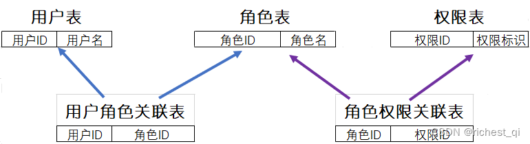

# 权限系统&模型

## 权限系统

权限系统：对于主体（访问发起者）请求客体（资源）的过程中，进行一定的访问控制策略，用于保护系统安全

权限一般可以细分为：功能权限（操作资源），数据权限（查看资源），页面/菜单权限

 

### 页面/菜单权限

对于没有权限操作的用户，直接隐藏对应的页面入口或菜单选项。这种方法简单快捷直接，对于一些安全不太敏感的权限，使用这种方式非常高效。

 

### 功能权限

功能权限决定主体和客体之间有哪些操作，一般会分为查询、增加、删除、编辑等权限。

功能权限的粒度可以细化到接口，也可以泛化为一个按钮、一个页面，或者一整个菜单模块。

粒度越细，那么授权给用户的工作量就越大，在不同场景下对主体/客体的身份动态分层，那么权限包的量级也会成倍增加，一般会采用**动态规则**的方式批量授权

 

### 数据权限

数据权限决定主体基于客体可以看到哪些数据，看到的数据种类、数据量级都有区分

一般情况下，客体的组织结构层级增加时，便会有数据权限的诉求。不同主体能够访问客体的哪些数据，一般是基于层级权限包（比如岗位）来批量授权。当组织管理日渐精细化，同一岗位下的主体身份不同，也需要支持动态授权。

## 权限模型

**权限模型=主体+客体+主客体间的访问控制策略**

**访问控制**（英语：Access control）是指对访问者向受保护资源进行访问操作的控制管理。该控制管理保证被授权者可访问受保护资源，未被授权者不能访问受保护资源。

在软件开发领域，有以下 9 种权限模型

 

### ACL 访问控制列表

ACL（Access Control List）是最早的、最基本的一种访问控制机制，是基于客体进行控制的模型。在其他模型中也有ACL的身影。为了解决相同权限的用户挨个配置的问题，后来也采用了用户组的方式。

原理：每一个客体都有一个列表，列表中记录的是哪些主体可以对这个客体做哪些行为，非常简单。

场景：

- 当用户A要对一篇文章进行编辑时，ACL会先检查一下文章编辑功能的控制列表中有没有用户A，有就可以编辑，无则不能编辑
- 不同等级的会员在产品中可使用的功能范围不同
- 为某个用户组分配读取某个资源的权限，而为另一个用户组分配修改该资源的权限。

优点：比较灵活，可以为每个用户或用户组分配不同的权限

缺点：当主体的数量较多时，配置和维护工作就会成本大、易出错

 

### DAC 自主访问控制

DAC（Discretionary Access Control）是ACL的一种拓展。

场景：常见于文件系统，LINUX，UNIX、WindowsNT版本的操作系统都提供DAC的支持

所谓自主，是因为拥有访问权限的主体，可以直接或间接地将自己拥有的权限授予其他主体，权限可以任意传递。例如在文件系统中，我们首先需要有对文件或文件夹的权限，才可以对其进行操作，并且我们可以将权限赋予给另一个用户

**缺点**：对权限控制比较分散，不便于管理，例如无法简单地将一组文件设置统一的权限开放给指定的一群用户。主体的权限太大，无意间就可能泄露信息。

 

### MAC 强制访问控制

MAC（Mandatory Access Control）模型中主要的是双向验证机制，每当主体尝试访问客体时，系统会**强制检查安全属性并决定是否可进行访问**

**原理**：主体和客体各有一个权限标识，而主体能否对该客体进行操作取决于双方的权限标识的关系。

场景：常见于机密机构或者其他等级观念强烈的行业，如军用和市政安全领域的软件。

举例：将军分为上将>中将>少将，军事文件保密等级分为绝密>机密>秘密，规定不同军衔仅能访问不同保密等级的文件，如少将只能访问秘密文件；当某一账号访问某一文件时，系统会验证账号的军衔，也验证文件的保密等级，当军衔和保密等级相对应时才可以访问。

**特点**：

- 控制太严格，访问权限有相应的管理设置策略，用户不能覆盖或修改策略
- 实现工作量大，缺乏灵活性
- 适合机密机构，但不适合商用

 

### RBAC 基于角色的权限访问控制

RBAC（Role-Based Access Control）的核心在于**权限与角色关联，用户只和角色关联**，用户通过成为适当角色的成员而得到这些角色的权限。

角色可依新的需求和系统的合并而赋予新的权限，而权限也可根据需要而从某角色中回收。角色与角色的关系同样也存在继承关系防止越权。

**优点**：便于角色划分，更灵活的授权管理；最小颗粒度授权；

用户与角色之间、角色与权限之间，一般是多对多的关系

RBAC三要素：

- **用户**：系统中所有的账户
- **角色**：一系列权限的集合（如：管理员，开发者，审计管理员等），是为了完成各种工作而创造，用户则依据它的责任和资格来被指派相应的角色，用户可以很容易地从一个角色被指派到另一个角色。
- **权限**：菜单，按钮，数据的增删改查等详细权限

RBAC 级别：

1、**RBAC0**：用户和角色是多对多，角色和权限是多对多。一个用户拥有的权限，是他所有角色的权限的集合。**RBAC0**相当于底层逻辑，后三者都是在**RBAC0**模型上的拔高

2、**RBAC1**：在RBAC0 基础上引入了**角色分级**的概念，类似于树形结构，每个等级对应的权限是不一样的，下级角色继承了上级角色的所有权限，并且支持针对性删减。把权限分给用户时，需要分到对应的角色等级。角色等级低时拥有的权限少，角色等级高的权限是所有角色等级低的权限的集合。

3、**RBAC2**：基于RBAC1，对角色访问进行限制。如：

- 互斥角色限制：角色互斥时，只能给用户分配其中一个。比如商务角色可以创建结算单并提交给账务审核，商务角色和账务角色就是互斥的，不能同时分配给同一个用户
- 角色数量限制：一个用户可拥有的角色数量受限制，一个角色可被分配的用户数量也受限制
- 先决条件限制：用户想获得某个上级角色，必须先获得其下一级的角色。比如想获得产品总监的权限，那就需要从产品助理这一角色开始，再到产品经理角色，最后到产品总监角色。
- 运行时限制：一个用户具有两个角色的成员资格，但在运行中不可同时激活这两个角色（动态职责分离DSD）

4、**RBAC3**：基于RBAC0，对RBAC1和RBAC2进行了整合，是最全面的权限管理。

 

**用户组**

当平台用户的基数增大，角色类型越来越多，一部分人具有相同的属性，比如财务部的所有员工，如果直接给每个用户分配角色，管理员的工作量就会很大。

如果把相同属性的用户归类到某个用户组，那么管理员就直接给用户组分配角色，用户组中的每个用户即可拥有对应的角色，以后其他用户只需要加入用户组，即可自动拥有用户组下的角色。

比如：一个部门是一个用户组，一种岗位是一个用户组，部门、岗位就是具有上下级关系的用户组

 

**自动获得基础角色**

当用户加入某个部门时，该用户自动被加入部门对应的基础角色中，并拥有对应的基础权限，这样可以保证系统安全的前提下，减少管理员的手动操作，提高效率

 

**临时角色与失效时间**

公司业务有时需要外援来支持，他们并不属于公司员工，也只是在某个时段在公司做支持。此时我们需要设置临时角色，来应对这种可能跨多部门协作的临时员工。

如果公司安全级别较高，此类账号默认有固定失效时间，到达失效时间需再次审核才能重新开启。避免临时账号因为流程不完善，遗忘在系统中，引起安全隐患。

 

**虚拟角色**

部门角色中的等级，可以授权同等级的员工拥有相同的权限，但某些员工因工作原因，需要调用角色等级之外的权限，相同等级不同员工需要使用的权限还不相同。

这种超出角色等级又合理的权限授予，我们可以设置虚拟角色。这一虚拟角色可集成这一工作所需的所有权限，然后将它赋予具体的员工即可。这样即不用调整组织架构和对应的角色，也可以满足工作中特殊情况的权限需求。

 

**黑白名单**

白名单：某些用户自身不拥有某部门的顶级角色，但处于业务需求，需要给他角色外的高级权限，那么我们可以设计限制范围的白名单，将需要的用户添加进去即可。

在安全流程中，我们仅需要对白名单设计安全流程，即可审核在白名单中的特殊用户，做到监控拥有特殊权限的用户，减少安全隐患。

黑名单：比如某些犯了错误的员工，虽然在职，但已经不能给他们任何公司权限了。这种既不能取消角色关联，也不能完全停用账号的情况，可以设置黑名单，让此类用户可以登录账号，查看基本信息，但大多数关键权限已经被黑名单限制。

 

**数据权限如何管控**

数据权限可以分为**行权限**和**列权限**

目前行业的做法是提供行列级数据权规则配置，把规则当成类似权限点配置赋予某个角色或者某个用户。

 

**超级管理员**

超级管理员是用来启动系统，配置系统的账号。这个账号应该在配置好系统，创建管理员之后被隐藏起来。超级管理员账号拥有系统中全部权限，可穿梭查看各部门数据，如果使用不恰当，是系统管理的安全隐患。

 

### ABAC 基于属性的访问控制

ABAC（Attribute-Based Access Control）这种方式更加灵活和精细，可以根据用户的属性、资源的属性以及环境条件来决定是否允许访问。

将实体的属性分为主体属性、客体属性和环境属性，访问时基于请求者和资源具有的属性动态判断

属性通常来说分为四类：

- 用户属性（如用户年龄）
- 环境属性（如当前时间）
- 操作属性（如读取）
- 对象属性（如一篇文章，又称资源属性）

**原理**：通过动态计算一个或一组属性是否满足某种机制来授权，是一种很灵活的权限模型，可以按需实现不同颗粒度的权限控制。这个模型在云系统中使用的比较多，比如 AWS，阿里云等。

场景：

- 授权某个人具体某本书的编辑权限
- 当一个文档的所属部门跟用户的部门相同时，用户可以访问这个文档
- 当用户是一个文档的拥有者并且文档的状态是草稿，用户可以编辑这个文档
- 早上九点前禁止 A 部门的人访问 B 系统
- 在除了上海以外的地方禁止以管理员身份访问 A 系统
- 用户对 2022-06-07 之前创建的订单有操作权限

特点

- 集中化管理属性。例如用户的区域、部门、业务线就是属性
- 实现不同颗粒度的权限控制，可以精确到请求中的某个具体属性
- 不需要预定义判断逻辑

缺点

- 规则可能过于复杂
- 由于权限需要实时判断，规则过多会有性能问题

 

### TBAC 基于任务的访问控制

对象的访问权限控制并不是静止不变的，而是随着执行任务的上下文环境发生变化，被赋予某个任务的时候才能有这个权限。

TBAC模型由工作流，授权结构体，受托人集，许可集四部分组成。一般用五元组（主体，客体，许可，生命周期，授权步）来表示。

场景：去银行办理，柜员在窗口有读取权，上交上一级后失去这个权利。

 

### NGAC 下一代访问控制

Next Generation Access Control，以用一个图来表示你要保护的系统，不同的主体（用户），基于某种功能策略（RBAC/ABAC），通过**一组标准化且通用的关系**来定义访问控制

- **指派关系：定义成员关系**。二元组（x,y）表示将元素x指派给元素y，通常意味着x包含于y。
- **职责关系：动态改变访问状态**。键值对(ep,r)表示当ep发生时，执行r。其中ep是事件模式，r是管理操作。
- **关联关系：确定特权**。三元组（ua,ars,at）表示ua中包含的用户可以对at引用的策略元素执行ars的访问权限。
- **禁止关系：定义例外特权**。u_deny（u,ars,¬pe）表示用户u只能对在pe中的策略元素执行ars的访问权限。

特点：

- 访问决策复杂时，不会损耗性能，可以线性扩展
- 可以基于对象属性或者其他属性，来配置权限
- 可以设置历时性策略（例如一次性的权限）

 

### T-RBAC 基于任务和角色的访问控制

T-RBAC 模型把任务和角色置于同等重要的地位, 它们是两个独立而又相互关联的重要概念。

先将访问权限分配给任务，再将任务分配给角色，角色通过任务与权限关联。任务是角色和权限交换信息的桥梁，是RBAC 和 TBAC 能结合的基础。

在T-RBAC模型中, 任务具有权限，角色只有在执行任务时才具有权限, 当角色不执行任务时不具有权限；权限的分配和回收是动态进行的，任务根据流程动态到达角色, 权限随之赋予角色；当任务完成时，角色的权限也随之收回；角色在工作流中不需要赋予权限。这样, 不仅使角色的操作、维护和任务的管理变得简单方便, 也使得系统变得更为安全。

 

### OBAC 基于对象的访问控制

将访问控制列表与受控对象或受控对象的属性相关联，并将访问控制选项设计成为用户，组或角色及其对应权限的集合。

允许对策略和规则进行重用，继承和派生操作。派生对象可以继承父对象的访问控制设置。

可以减轻由于信息资源的派生，演化和重组等带来的分配

控制策略和控制规则是OBAC访问控制系统的核心所在，在基于受控对象的访问控制模型中，将访问控制列表与受控对象或受控对象的属性相关联，并将访问控制选项设计成为用户、组或角色及其对应权限的集合；同时允许对策略和规则进行重用、继承和派生操作。这样，不仅可以对受控对象本身进行访问控制，受控对象的属性也可以进行访问控制，而且派生对象可以继承父对象的访问控制设置，这对于信息量巨大、信息内容更新变化频繁的管理信息系统非常有益，可以减轻由于信息资源的派生、演化和重组等带来的分配、设定角色权限等的工作量。

OBAC从信息系统的数据差异变化和用户需求出发，有效地解决了信息数据量大、数据种类繁多、数据更新变化频繁的大型管理信息系统的安全管理。OBAC从受控对象的角度出发，将访问主体的访问权限直接与受控对象相关联，一方面定义对象的访问控制列表，增、删、修改访问控制项易于操作，另一方面，当受控对象的属性发生改变，或者受控对象发生继承和派生行为时，无须更新访问主体的权限，只需要修改受控对象的相应访问控制项即可，从而减少了访问主体的权限管理，降低了授权数据管理的复杂性。

 

### UCON 使用控制模型

UsageControl，也称 ABC 模型，包含三个基本元素: 主体、客体、权限和另外三个与授权有关的元素: 授权规则、条件、义务。

主体( Subjects)：它是具有某些属性和对客体(Objects)操作权限的实体。主体的属性包括身份、角色、安全级别、成员资格等。这些属性用于授权过程。

客体( Objects) ：它是主体的操作对象，它也有属性，包括安全级别、所有者、等级等。这些属性也用于授权过程。

权限( Rights)：它是主体拥有的对客体操作的一些特权。权限由一个主体对客体进行访问或使用的功能集组成。UCON中的权限可分成许多功能类, 如审计类、修改类等。

授权规则( AuthorizationRules) ：它是允许主体对客体进行访问或使用前必须满足的一个需求集。授权规则是用来检查主体是否有资格访问客体的决策因素。

条件( Conditions)：它是在使用授权规则进行授权过程中, 允许主体对客体进行访问权限前必须检验的一个决策因素集。条件是环境的或面向系统的决策因素。条件可用来检查存在的限制, 使用权限是否有效,哪些限制必须更新等。

义务( Obligations)：它是一个主体在获得对客体的访问权限后必须履行的强制需求。分配了权限, 就应有执行这些权限的义务责任。

在UCON模型中, 授权规则、条件、义务与授权过程相关，它们是决定一个主体是否有某种权限能对客体进行访问的决策因素。基于这些元素, UCON有四种可能的授权过程, 并由此可以证明：UCON模型不仅包含了DAC，MAC，RBAC，而且还包含了数字版权管理（DRM）、信任管理等。

UCON 模型涵盖了现代商务和信息系统需求中的安全和隐私这两个重要的问题。因此, UCON模型为研究下一代访问控制提供了一种有希望的方法, 被称作**下一代访问控制模型**

