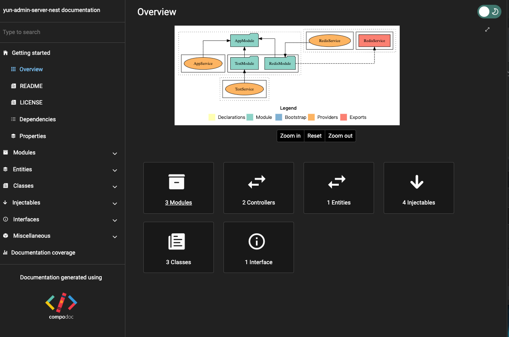

# 集成 compodoc


Nest 项目中有很多模块，模块之间相互依赖，模块内有 controller、service 等，当项目复杂之后，模块之间的关系错综复杂。

这时候我们可以用 [compodoc](https://www.npmjs.com/package/@compodoc/compodoc) 生成一份文档，把依赖关系可视化

官网：https://compodoc.app/


## 概述

Compodoc是一个文档工具，专门为Angular应用程序和TypeScript项目生成文档。它会生成一个静态网站，其中包含你的应用程序的所有信息，包括模块、组件、指令、服务等的详细信息。

它的主要特性包括：

- 支持TypeScript和Javascript的API文档生成
- 支持Markdown文件
- 提供搜索功能
- 提供图形化的依赖图
- 支持主题切换
- 支持国际化

因为 nest 项目结构与 angular 类似，所以也支持了 nest


## 用法

### 安装

安装依赖

```shell
pnpm add -D @compodoc/compodoc
```

<br/>

### 生成文档

运行如下命令

```shell
npx @compodoc/compodoc -p tsconfig.json -s -o
# 或者
pnpm dlx @compodoc/compodoc -p tsconfig.json -s -o
```

这将会在项目根目录下生成一个名为documentation的目录，其中包含你的项目文档的静态网站。你可以通过在浏览器中打开documentation/index.html来查看你的项目文档。


