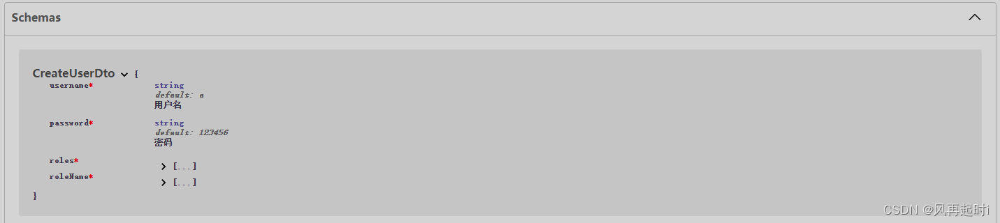
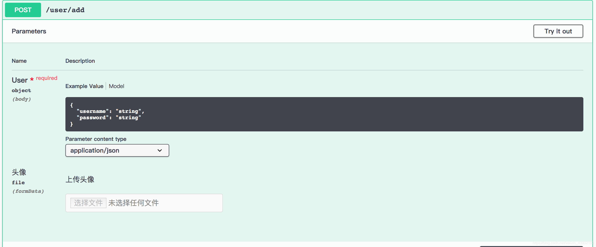

# 集成 Swagger


## 用法

### 安装

安装 swagger 依赖

```
pnpm add @nestjs/swagger
```

<br/>

### 配置

在 main.ts 中增加如下配置

```typescript
import { NestFactory } from '@nestjs/core';
import { AppModule } from './app.module';
import { DocumentBuilder, SwaggerModule } from '@nestjs/swagger';

async function bootstrap() {
  // 创建应用实例
  const app = await NestFactory.create(AppModule);
  // swagger相关配置
 const swaggerConfig = new DocumentBuilder()
    // 文档标题
    .setTitle('yun-admin')
    // 文档介绍，副标题
    .setDescription('yun-admin后台管理系统')
    // 文档版本
    .setVersion('1.0')
    // 鉴权
    .addBearerAuth({
      type: 'http',
      description: '基于 jwt 的认证',
      name: 'bearer',
    })
    .build();
  const document = SwaggerModule.createDocument(app, swaggerConfig);
  SwaggerModule.setup('doc', app, document);

  await app.listen(3000);
}
bootstrap();
```

`DocumentBuilder`是一个辅助类，用来生成文档的配置，可以设置：标题、版本、介绍、标签等

`SwaggerModule.createDocument()`方法用来创建文档，有两个参数，分别是：应用程序实例、Swagger配置

`SwaggerModule.setup()`方法创建文档的 url，它依次接受：访问文档的相对路径、应用程序实例、swagger文档对象

上面的配置完成后，打开 localhost:3000/doc，即可看到文档

<br/>

### 多文档配置

```typescript
import { NestFactory } from '@nestjs/core';
import { DocumentBuilder, SwaggerModule } from '@nestjs/swagger';
import { AppModule } from './app.module';
import { UserModule } from './user/user.module';
 
async function bootstrap() {
  const app = await NestFactory.create(AppModule);
  
  // 用户模块文档
  const options = new DocumentBuilder()
    .setTitle('用户信息文档')
    .setDescription('用于用户信息的增删改查')
    .setVersion('1.0')
    .addTag('用户,安全')
    .build();
 
  const userDocument = SwaggerModule.createDocument(app, options, {
    include: [UserModule], // 包含的模块
  });
  SwaggerModule.setup('api/user', app, userDocument);
 
  // 全部模块文档
  const secondOptions = new DocumentBuilder()
    .setTitle('整体文档')
    .setDescription('包含了测试文档和前台应用文档')
    .setVersion('1.0')
    .addTag('用户,安全')
    .build();
 
  const appDocument = SwaggerModule.createDocument(app, secondOptions, {
    include: [AppModule, UserModule], // 指定包含的模块
  });
  SwaggerModule.setup('api', app, appDocument);
 
  await app.listen(3000);
}
bootstrap();
```


> swagger 是基于 openapi 标准实现的，访问 swagger 文档的 `/doc-json` 路径时，可以看到对应的 json
>
> 一般的平台都支持 openapi


## 常用装饰器

均来自`@nestjs/swagger`

<br/>

### @ApiTags 分组描述

在 controller 类上添加，让对应的模块分类到对应的标签当中

```typescript
import { ApiTags } from '@nestjs/swagger';
import { Controller, Get, Query } from '@nestjs/common';

@ApiTags('用户,安全')
@Controller('/user')
export class UserController {
	//...
}
```

<br/>

### @ApiOperation 接口描述

```typescript
  @Post()
  @ApiOperation({ summary: '测试post接口创建数据', description: '接口描述' })
  create(@Body() createTestDto: CreateTestDto) {
    return this.testService.create(createTestDto);
  }
```

<br/>

### @ApiResponse 响应描述

```typescript
	@ApiResponse({ status: 401, description: '权限不足'})
	@Post('/add')
	public addUser(@Body() user: User) {
	   return user;
	}
```


<br/>

### @ApiQuery、@ApiBody、@ApiParam、@ApiHeader、@ApiHeaders 参数描述

用来对 controller 的方法参数进行描述，会在文档上显示请求参数的相关约束信息

除了ApiHeaders之外，其它的接收一个对象，对象类型如下：

```typescript
{
  name: string; // 该数据的名称，比如:id可以写用户id或者id
	description?: string; // 简介
	required?: boolean; // 是否是必须的
	type?: any; // 类型
	isArray?: boolean; // 是否是数组
	enum?: SwaggerEnumType; // 枚举类型
	collectionFormat?: "csv" | "ssv" | "tsv" | "pipes" | "multi";
}
```

ApiHeaders 的参数对象只有 3 个参数

```typescript
{
  name: string; // 该数据的名称，比如:id可以写用户id或者id
	description?: string; // 简介
	required?: boolean; // 是否是必须的
}
```

示例

```typescript
import { Controller, Get, Param, Query } from '@nestjs/common';
import { ApiTags, ApiParam, ApiQuery, ApiHeader } from '@nestjs/swagger';
import { UserService } from './user.service';
 
@ApiTags('用户,安全')
@Controller('/user')
export class UserController {
    constructor(private userService: UserService) { }
  
    @Get('/get/:id')
    @ApiParam({
        name: 'id',
        description: '这是用户id',
    })
    @ApiQuery({
        name: 'role',
        description: '这是需要传递的参数',
    })
    @ApiHeader({
        name: 'authoriation',
        required: true,
        description: '本次请求请带上token',
    })
    public getUser(@Param('id') id: string, @Query('role') role: string): string {
        return this.userService.getUser(id);
    }
}
```

<br/>

### @ApiProperty DTO描述

在声明 dto 的对象上使用 `ApiProperty()` 注解添加参数（属性）注释

```typescript
import { ApiProperty } from '@nestjs/swagger';
 
export class CreateUserDto {
  @ApiProperty({ description: '用户名', default: 'a' })
  username: string;
 
  @ApiProperty({ description: '密码', default: '123456' })
  password: string;
}
```

在接口中使用该 dto 对象

```typescript
@Post()
async create(@Body() createCatDto: CreateCatDto) {
  this.catsService.create(createCatDto);
}
```

在 swagger 文档中就可以看到对应的标注



<br/>

### @ApiImplicitFile 文件上传测试

```typescript
    @ApiResponse({ status: 401, description: '权限不足'})
    @ApiImplicitFile({
        name: '头像',
        description: '上传头像',
        required: false,
    })
    @Post('/add')
    public addUser(@Body() user: User) {
        return user;
    }
```



<br/>

### @ApiBearerAuth、@ApiCookieAuth、@ApiBasicAuth 权限描述

swagger 也提供了 jwt、cookie 认证方式的支持。

在 main.ts 中的 swagger 配置中增加如下的认证方式：

```typescript
const config = new DocumentBuilder()
    .setTitle('Test example')
    .setDescription('The API description')
    .setVersion('1.0')
    .addTag('test')
    .addBasicAuth({
      type: 'http',
      name: 'basic',
      description: '用户名 + 密码'
    })
    .addCookieAuth('sid', {
      type: 'apiKey',
      name: 'cookie',
      description: '基于 cookie 的认证'
    })
    .addBearerAuth({
      type: 'http',
      description: '基于 jwt 的认证',
      name: 'bearer'
    })
    .build();

```

然后在接口上使用相应的注解，在 swagger 文档上就会看到如下内容，如果不指定某个接口，它会应用在整个文档上


表示该接口需要权限信息才能正常访问，点击锁标志，会弹出一个对话框，如下：


输入认证信息后，该接口就可以正常访问。
