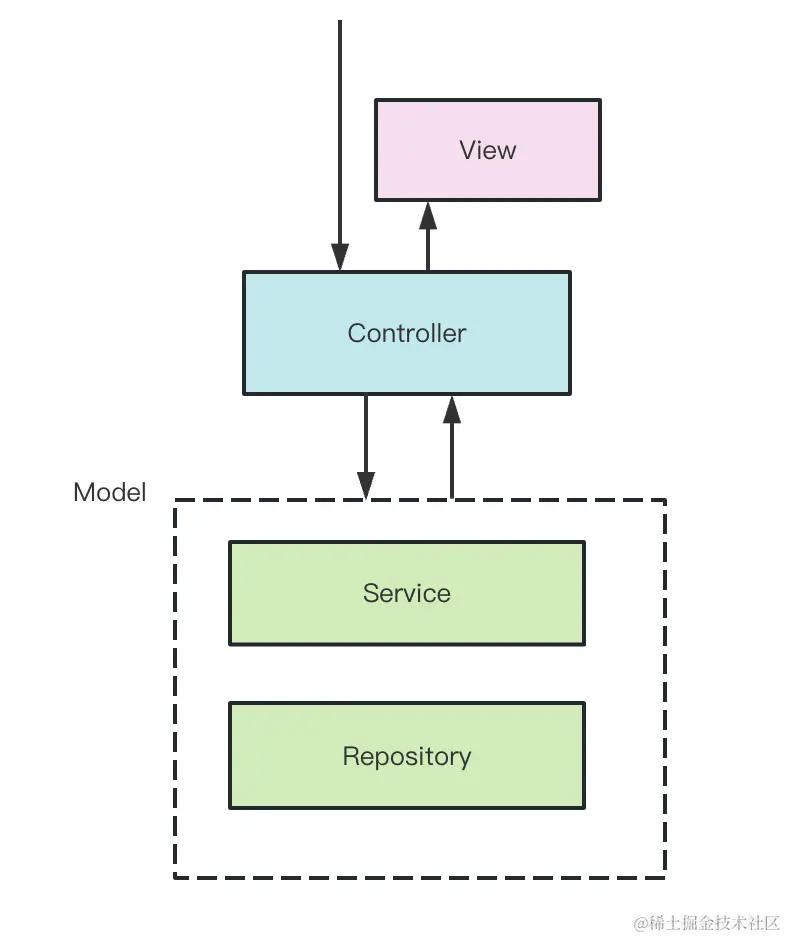
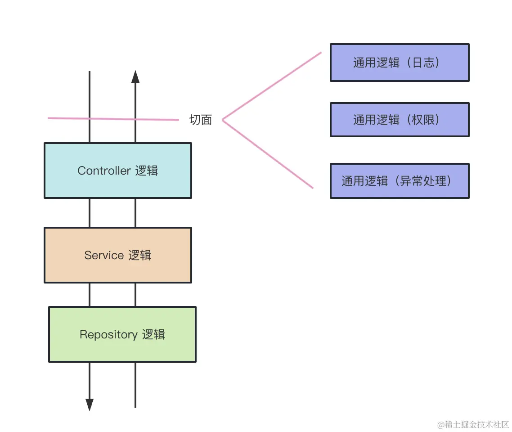
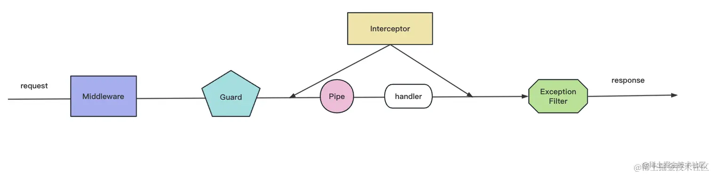

# 理解 AOP


## 概述

面向切面编程（Aspect-Oriented Programming，简称 AOP）是一种编程范式，其目标是提高模块化程度，特别是对于横切关注点（cross-cutting concerns）的处理。

在许多应用中，有一些功能是跨越多个模块的，例如日志记录、事务管理、安全性等。这些功能往往会散布在整个代码库中，导致代码重复和难以维护。AOP 的目标就是将这些横切关注点从它们所影响的业务逻辑中分离出来，以提高代码的模块化程度。

<br/>

## AOP

后端框架基本都是 MVC（Model View Controller） 的架构。请求会先发送给 Controller，由它调度 Model 层的 Service 来完成业务逻辑，然后返回对应的 View。



在上面这个流程中，想加入一些通用逻辑，比如：日志记录、权限控制、异常处理等，如果是在 Controller 层代码加入逻辑，一是不优雅，二是侵入了业务逻辑，所以可以在调用 Controller 之前和之后加入一个执行通用逻辑的阶段，例如：



所以，**AOP 的好处是可以把一些通用逻辑分离到切面中，保持业务逻辑的纯粹性，这样切面逻辑可以复用，还可以动态的增删**

> Koa 的洋葱模型也是一种 AOP 的实现，可以在不侵入业务的在外面包一层，加入一些逻辑，内层感知不到

在 AOP 中，主要有以下几个概念：

- 切面（Aspect）：一个关注点的模块化表示，通常包含一些通用的功能，如日志记录、事务管理等
- 连接点（Join point）：程序执行过程中的某个特定位置，如方法调用、异常抛出等
- 通知（Advice）：切面在特定连接点执行的代码。通知类型有“前置通知”、“后置通知”、“环绕通知”等
- 切入点（Pointcut）：一组连接点的集合，定义了通知应该在哪些连接点执行
- 引入（Introduction）：用于在类中添加一些新的方法或字段
- 织入（Weaving）：将切面应用到目标对象以创建新的代理对象的过程。


## 示例

在 NestJS 中，可以使用装饰器和拦截器来实现 AOP。例如，你可以创建一个日志拦截器，用于在每个方法调用前后记录日志：

```typescript
import { Injectable, NestInterceptor, ExecutionContext, CallHandler } from '@nestjs/common';
import { Observable } from 'rxjs';
import { tap } from 'rxjs/operators';

@Injectable()
export class LoggingInterceptor implements NestInterceptor {
  intercept(context: ExecutionContext, next: CallHandler): Observable<any> {
    console.log('Before...');

    const now = Date.now();
    return next
      .handle()
      .pipe(
        tap(() => console.log(`After... ${Date.now() - now}ms`)),
      );
  }
}
```

然后，你可以在你的控制器或者服务中使用 `@UseInterceptors()` 装饰器来应用这个拦截器：

```typescript
import { Controller, UseInterceptors } from '@nestjs/common';
import { LoggingInterceptor } from './logging.interceptor';

@Controller()
@UseInterceptors(LoggingInterceptor)
export class AppController {
  // ...
}
```

这样，每次调用 AppController 的方法时，都会自动记录日志。


## Nest 的 AOP

Nest 实现 AOP 的方式一共有五种，包括 Middleware、Guard、Pipe、Interceptor、ExceptionFilter


### Middleware 中间件

Nest 的底层是 Express，所以实际上等价于 [express](http://expressjs.com/en/guide/using-middleware.html) 中间件

必须实现`NestMiddleware`接口，需要重写 use 方法，该方法有三个参数：request、response、next，最后必须执行 `next()`，否则会阻塞请求

支持全局级别、路由级别


### Guard 守卫

用于在调用某个 Controller 之前判断权限，返回 true 或者 false 来决定是否放行

> 可以理解为 vue-router 的路由守卫 beforeEach

Guard 要实现 CanActivate 接口，实现 canActivate 方法，可以从 context 拿到请求的信息，然后做一些权限验证等处理之后返回 true 或者 false。

Guard 可以抽离路由的访问控制逻辑，但是不能对请求、响应做修改

支持全局级别、路由级别


### Interceptor 拦截器

可以在目标 Controller 方法前后加入一些逻辑

Interceptor 要实现 NestInterceptor 接口，实现 intercept 方法，调用 next.handle() 就会调用目标 Controller，可以在之前和之后加入一些处理逻辑。

支持全局级别、路由级别


### Pipe 管道

用来对参数做一些检验和转换

Pipe 要实现 PipeTransform 接口，实现 transform 方法，里面可以对传入的参数值 value 做参数验证，比如格式、类型是否正确，不正确就抛出异常。也可以做转换，返回转换后的值

支持对每个路由生效，或某个路由生产，或某个参数生效


### ExceptionFilter 异常过滤器

不管是 Pipe、Guard、Interceptor 还是最终调用的 Controller，过程中都可以抛出一些异常。ExceptionFilter 就可以对抛出的异常做处理，返回对应的响应

要实现 ExceptionFilter 接口，实现 catch 方法，就可以拦截异常了，但是要拦截什么异常还需要用 @Catch 装饰器来声明，拦截了异常之后，可以返回对应的响应，给用户更友好的提示。

支持全局级别、路由级别


## Nest 中 AOP 的顺序

Middleware、Guard、Pipe、Interceptor、ExceptionFilter 都可以透明的添加某种处理逻辑到某个路由或者全部路由，而不对业务代码进行侵入，这就是 AOP 的好处。



1、进入路由的时候，会先调用 Guard，判断是否有权限等，如果没有权限，就抛异常

2、抛出的 ForbiddenException 会被 ExceptionFilter 处理，返回 403 状态码

3、如果有权限，就会调用到拦截器，拦截器组织了一个链条，一个个的调用，去往 controller

4、调用 controller 方法之前，会使用 pipe 对参数做处理

5、最后调用 controller

ExceptionFilter 的调用时机，就是在响应之前对异常做一次处理
