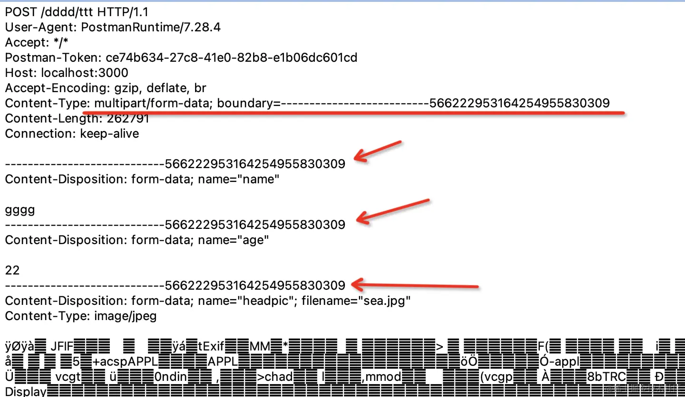

# HTTP 数据传输（接口参数）


## url param 路径参数

如：`http://guang.zxg/person/1111`

nest 实现

```typescript
// src/person/person.controller.ts

@Controller('person')
export class PersonController {
  @Get(':id')
  urlParam(@Param('id') id: string) {
    return `received: id=${id}`;
  }
}
```

前端请求

```js
async function urlParam() {
	const res = await axios.get('/person/1');
	console.log(res);            
}
```


## query 参数

如：`http://guang.zxg/person?name=guang&age=20`，name 和 age 就是参数

非英文的字符和一些特殊字符要经过编码，可以使用 encodeURIComponent 的 api 来编码：

```js
const query = "?name=" + encodeURIComponent('光') + "&age=20"

// ?name=%E5%85%89&age=20
```

或者使用封装了一层的 query-string 库来处理

```js
const queryString = require('query-string');

queryString.stringify({
  name: '光',
  age: 20
});

// ?name=%E5%85%89&age=20
```

nest 实现

```typescript
@Controller('person')
export class PersonController {
  @Get('find')
  query(@Query('name') name: string, @Query('age') age: number) {
    return `received: name=${name},age=${age}`;
  }
}
```

前端请求

```js
async function query() {
	const res = await axios.get('/person/find', {
		params: {
			name: '光',
			age: 20
		}
	});
	console.log(res);            
}
```


## form-urlencoded 表单参数

直接用 form 表单提交数据，和 query 字符串的方式的区别只是放在了 body 里，并且需要指定 `content-type :application/x-www-form-urlencoded`


它的内容也是 query 字符串，所以也要对参数进行编码处理

nest 实现，使用 @Body 装饰器，Nest 会解析请求体，然后注入到 dto 中

```typescript
import { CreatePersonDto } from './dto/create-person.dto';

@Controller('person')
export class PersonController {
  @Post()
  body(@Body() createPersonDto: CreatePersonDto) {
    return `received: ${JSON.stringify(createPersonDto)}`
  }
}
```

前端请求

```js
async function formUrlEncoded() {
  const res = await axios.post('/person', Qs.stringify({
    name: '光',
    age: 20
  }), {
    headers: { 'content-type': 'application/x-www-form-urlencoded' }
  });
  console.log(res);
}
```


## form-data

指定 content type 为 `multipart/form-data`，数据是用 `--------- + 一串数字`做为 boundary 分隔符，不需要 url encode



Nest 解析 form data 使用 FilesInterceptor 的拦截器，用 @UseInterceptors 装饰器启用，然后通过 @UploadedFiles 来获取非文件的内容，同样是通过 @Body 来取

安装 `npm i -D @types/multer`提供类型声明

```typescript
import { AnyFilesInterceptor } from '@nestjs/platform-express';
import { CreatePersonDto } from './dto/create-person.dto';

@Controller('person')
export class PersonController {
  @Post('file')
  @UseInterceptors(AnyFilesInterceptor({
      dest: 'uploads/'
  }))
  body2(@Body() createPersonDto: CreatePersonDto, @UploadedFiles() files: Array<Express.Multer.File>) {
    console.log(files);
    return `received: ${JSON.stringify(createPersonDto)}`
  }
}
```

前端请求

```js
<input id="fileInput" type="file" multiple/>
<script>
const fileInput = document.querySelector('#fileInput');

async function formData() {
  const data = new FormData();
  data.set('name','光');
  data.set('age', 20);
  data.set('file1', fileInput.files[0]);
  data.set('file2', fileInput.files[1]);

  const res = await axios.post('/person/file', data, {
    headers: { 'content-type': 'multipart/form-data' }
  });
  console.log(res);
}

fileInput.onchange = formData;
</script>
```


## json

指定`content type: application/json`，是 http 请求中最常见的

nest 实现，使用 @Body 来接收，Nest 内部会根据 content type 区分不同的解析方式

```typescript
@Controller('person')
export class PersonController {
  @Post()
  body(@Body() createPersonDto: CreatePersonDto) {
    return `received: ${JSON.stringify(createPersonDto)}`
  }
}
```

前端请求

```js
async function json() {
  const res = await axios.post('/person', {
    name: '光',
    age: 20
  });
  console.log(res);
}
```

