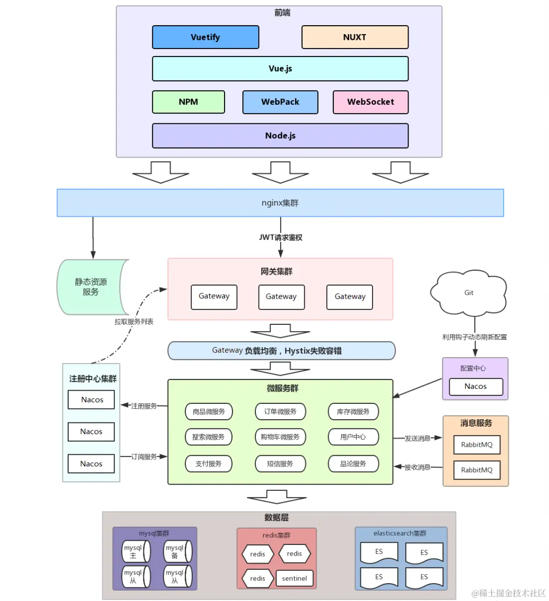

# Nest 概述

[官网](https://nestjs.com/) | [中文官网](https://docs.nestjs.cn/)

## 介绍

Nest 是一个用于构建高效、可扩展的 Nodejs 服务端应用程序的框架。

可以使用 js，也内置并完全支持 ts，结合了 OOP（面向对象编程）、FP（函数式编程）、FRP（函数式响应编程） 的元素。设计上很多灵感来源于Angular，而Angular的很多模式又来自于Spring框架，依赖注入、面向切面等。所以可以认为Nest是nodejs版的Spring框架。

在底层，Nest 使用强大的 HTTP Server 框架，如 Express（默认）和 Fastify。Nest 在这些框架之上提供了一定程度的抽象，同时也将其 API 直接暴露给开发人员。这样可以轻松使用每个平台的无数第三方模块。

 

**核心思想：提供一个层与层直接的耦合度极小，抽象化极高的架构体系。**

 

### 哲学

虽然 Node（和服务器端 JavaScript ）存在大量优秀的库，帮助器和工具，但它们都没有有效地解决主要问题 - **架构**。

Nest 提供了一个开箱即用的应用程序架构，允许开发人员和团队创建高度可测试，可扩展，松散耦合且易于维护的应用程序。

 

### 优秀的架构设计

Nest 的架构很优雅，因为它用了不少设计模式，比如：Nest 并不和 Express 耦合，你可以轻松切换到 Fastify，因为它用了适配器的设计模式。

Nest 本身只依赖 HttpServer 接口，并不和具体的库耦合。想使用其他的 http 处理的库，只要实现一个适配器就可以了。

再比如 Nest 内构建复杂对象很多地方都用到了 builder 的设计模式

 

### 最流行的 Node 企业级框架

开发 node web 应用有 3 个层次：

- 直接用 http、https 包的 createServer api，适合特别简单的场景，比如工具提供的开发服务
- 使用 express、koa 这种处理请求响应的库，对代码没有约束，写法可以很随意，不适合大型项目
- 使用 nest、egg、midway 这类企业级框架，规定了代码的写法，对很多功能都有开箱即用的解决方案

> egg：ts 支持不行，在当下 ts 这么主流的情况下，已经不合适了。更何况它是阿里的项目，而阿里 egg 团队也被打包裁了。
>
> midway：star 数差太多，与 nest 不是一个量级，有可能是另一个 egg
>
> koa：曾经使用 koa 完成过一个项目，感受上就是框架本身很轻量，但是生态不够，每个功能都要自己手动实现，不适合做大型项目开发，更适合作为底层依赖

 

nest 在全球范围内越来越火，生态越来越好，基本是 node web 企业级框架的唯一选择。

同时，nest 会用到很多中间件，比如 mysql、redis、rabbitmq、nacos、elasticsearch 等等

所以，以 nest 为切入，学习整个后端生态，是非常 不错的选择，就算换了其他语言，这些中间件依然会用到，只是语法上的不同，基础的概念和原理不会变。

## 快速开始

### 环境搭建

安装Nest CLI：`npm i -g @nestjs/cli`

验证：`nest -v`，输出版本号即为安装成功

使用Nest CLI创建项目：`nest new 项目名`，可以选择包管理器

运行项目：`npm run start:dev`，此命令会启动HTTP

 

### 快速开始

当使用 nestjs 进行实际开发时，一般都需要 controller、service等文件，可以使用 nest cli 的命令进行快速生成，查看[nest-cli](nest-cli.md)
