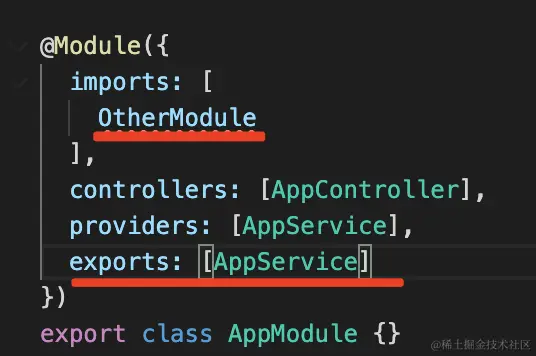

# 理解 IoC


## 基本概念

### IoC（Inversion of Control，控制反转）

一种面向对象编程中的设计原则，用来降低代码之间的耦合度，主要针对**对象实例化**这个过程。

将组件对象的控制权从程序代码本身转移到了外部容器，将程序的操作对象调用权交给容器（container），从而实现对象组件的装配和管理。

<br/>

> 理解一下：常规的使用中，在哪里调用，就要先使用 new 实例化对象，而控制反转就是把实例化对象这个过程交给容器自动实现，代码中只管调用，容器会把对应的实例自动注入

<br/>

### DI（Dependency Injection，依赖注入）

简单来说，IoC是一种思想、原则，而 DI 是这种思想的具体实现方式、方案。

其他的**依赖注入的方式**：

1. 构造器注入： 依赖关系通过 class 构造器提供；nest 采用的方式
2. setter 注入：用 setter 方法注入依赖项；
3. 接口注入：依赖项提供一个注入方法，该方法将把依赖项注入到传递给它的任何客户端中。客户端必须实现一个接口，该接口的 setter 方法接收依赖；

<br/>

### IoC 核心思想

理解 `IoC` 思想的关键在于：

1. 谁控制谁

   在传统程序设计中，一般会直接在对象内部通过 new 的方式创建对象，是程序主动创建依赖对象。

   在 IoC 中有专门的容器来创建这些对象，即**由IoC容器控制对象的创建**。

2. 控制什么

   主要是控制**外部资源（所依赖对象）**的获取

3. 为何是反转

   传统应用程序是由我们自己在程序中**主动控制**去获取依赖对象，这叫 `正转` 。`反转` 则是由**容器来帮忙创建及注入依赖对象**。

   在 `IoC` 的思想中，由于容器帮我们查找及注入依赖对象，对象只是**被动**的接受依赖对象，所以是**反转** 了

4. 哪些方面反转了

   依赖对象的获取被反转了

<br/>

### 优点

1. 可维护性较好：便于单元测试、调试程序和诊断故障（彼此之间互不影响）。
2. 大中型项目中，团队成员分工明确，不用依赖于他人的组件。
3. 可复用性好：可以把具有普遍性的常用组件独立出来，反复应用到项目中的其他部分。
4. 生成对象的方式转为外置方式：把对象生成放在配置文件中进行定义。

<br/>

### 举例说明

在后端系统中，有很多对象，比如：

- Controller 对象：接收 http 请求，调用 Service，返回响应
- Service 对象：实现业务逻辑
- Repository 对象：实现对数据库的增删改查
- DataSource 对象：数据库链接对象
- Config 对象：配置对象

这些对象有着错综复杂的关系：

Controller 依赖了 Service 实现业务逻辑，Service 依赖了 Repository 来做增删改查，Repository 依赖 DataSource 来建立连接，DataSource 又需要从 Config 对象拿到用户名密码等信息

这就导致了创建这些对象是很复杂的，需要理清它们之间的依赖关系，哪个先创建哪个后创建。并且像 Config、DataSource 对象不需要每次 new 一个新的，保持单例即可。

如果这个过程手动维护会很繁琐，并且容易出错，这是后端系统的一个痛点，而解决它的方式就是 IoC，像 Spring、Nest 都实现了这种方式。


## 深入理解 IoC

### 依赖倒置原则

先了解软件设计的一个重要思想：**依赖倒置原则（Dependency Inversion Principle ）。**

假设我们设计一辆汽车：先设计轮子，然后根据轮子大小设计底盘，接着根据底盘设计车身，最后根据车身设计好整个汽车。这里就出现了一个“依赖”关系：汽车依赖车身，车身依赖底盘，底盘依赖轮子。


这样的设计，最大的问题就是**可维护性很低**。

假设设计完工之后，突然需求变动，要把车子的轮子设计都改大一码。这下就蛋疼了：因为我们是根据轮子的尺寸设计的底盘，轮子的尺寸一改，底盘的设计就得修改；同样因为是根据底盘设计的车身，那么车身也得改，同理汽车设计也得改，整个设计几乎都得改！

现在换一种思路：我们先设计汽车的大概样子，然后根据汽车的样子来设计车身，根据车身来设计底盘，最后根据底盘来设计轮子。这时候，依赖关系就倒置过来了：轮子依赖底盘， 底盘依赖车身， 车身依赖汽车。


这就是**依赖倒置原则**：把原本的上层依赖底层**“倒置”**过来，变成**底层依赖上层**。上层需要什么，底层去实现这样的需求，但是高层并不用管底层是怎么实现的。这样就不会出现前面的“牵一发动全身”的情况。


### 控制反转（Inversion of Control）

控制反转就是依赖倒置原则的一种代码设计思路，具体采用的方法就是依赖注入。


### js 实现与理解

首先，我们为最终的目标创建了各种低层类

```typescript
class A {
    name: string
    constructor(name: string) {
        this.name = name
    }
}


class C {
    name: string
    constructor(name: string) {
        this.name = name
    }
}
```

然后有一个IoC容器，来收集这些低层依赖的实例

```typescript
// IoC容器中间件用于解耦
class Container {
    modeuls: any
    constructor() {
        this.modeuls = {}
    }
    provide(key: string, modeuls: any) {
        this.modeuls[key] = modeuls
    }
    get(key) {
        return this.modeuls[key]
    }
}

const mo = new Container()
mo.provide('a', new A('小满1'))
mo.provide('c', new C('小满2'))
```

 最终使用时，只需要取出这些低层依赖的实例，创建我们需要的结果

```typescript
class B {
    a: any
    c: any
    constructor(container: Container) {
        this.a = container.get('a')
        this.c = container.get('c')
    }
}

new B(mo)
```


## Nest 中如何实现 IoC

在 NestJS 中，实现依赖注入的核心机制是通过 Nest 提供的装饰器和依赖注入容器。NestJS 使用了 TypeScript 的装饰器和元数据功能来实现依赖注入。

以下是在 NestJS 中实现依赖注入的一般步骤：

1、定义 provider，即可注入的服务类

这个类负责实现具体的业务逻辑。可以使用 `@Injectable()` 装饰器将其标记为可注入的服务类。

```typescript
import { Injectable } from '@nestjs/common';

@Injectable()
export class MyService {
  // 实现服务的具体逻辑
}
```

2、注册 provider

在需要使用该 provider 的模块中，使用 `providers` 数组来注册提供者。提供者可以是服务类本身，也可以是由 `useFactory`、`useValue` 或 `useClass` 提供的自定义对象。

```typescript
import { Module } from '@nestjs/common';
import { MyService } from './my.service';
import { MyOtherService } from './my-other.service';

@Module({
  providers: [MyService, MyOtherService],
})
export class MyModule {}
```

还可以使用 `@Module()` 装饰器的 `imports` 属性来导入其他模块，以获取它们提供的服务。

3、注入服务

在需要使用这个服务的地方，使用构造函数注入或属性注入方式来引入该服务。使用 `@Inject()` 装饰器来标记需要注入的属性或参数。

构造函数注入：

```typescript
import { Injectable, Inject } from '@nestjs/common';
import { MyService } from './my.service';

@Injectable()
export class MyOtherService {
  constructor(private readonly myService: MyService) {}
}
```

属性注入：

```typescript
import { Injectable, Inject } from '@nestjs/common';
import { MyService } from './my.service';

@Injectable()
export class MyOtherService {
  @Inject()
  private readonly myService: MyService;
}
```

4、使用依赖注入的服务

使用注入的服务时，可以在组件或服务中直接引用它，Nest 会负责创建和管理这些服务的实例。

```typescript
import { Controller, Get } from '@nestjs/common';
import { MyService } from './my.service';

@Controller('my')
export class MyController {
  constructor(private readonly myService: MyService) {}

  @Get()
  getHello(): string {
    return this.myService.getHello();
  }
}
```


## Nest 中使用 IoC

创建一个基本的 nest 项目后，在 app.service.ts 中

```typescript
import { Injectable } from '@nestjs/common';

@Injectable()
export class AppService {
  getHello(): string {
    return 'Hello World!';
  }
}
```

AppService 声明了 @Injectable，代表这个 class 可被注入，那么 nest 就会把它的对象放到 IOC 容器里

在 app.controller.ts 中

```typescript
import { Controller, Get } from '@nestjs/common';
import { AppService } from './app.service';

@Controller()
export class AppController {
  constructor(private readonly appService: AppService) {}

  @Get()
  getHello(): string {
    return this.appService.getHello();
  }
}
```

AppController 声明了 @Controller，代表这个 class 可以被注入，nest 也会把它放到 IOC 容器里。

> 注意：@Injectable 声明的对象，可以被注入，也可以注入到别的对象，@Controller 声明的对象，只需要被注入

然后把它们在 AppModule 里引入：

```typescript
import { Module } from '@nestjs/common';
import { AppController } from './app.controller';
import { AppService } from './app.service';
import { PersonModule } from './person/person.module';

@Module({
  imports: [PersonModule],
  controllers: [AppController],
  providers: [AppService],
})
export class AppModule {}
```

通过 @Module 声明模块：

- 其中 controllers 是控制器，只能被注入
- providers 里可以被注入，也可以注入别的对象，比如这里的 AppService

最后在入口模块里跑起来：

```typescript
import { NestFactory } from '@nestjs/core';
import { AppModule } from './app.module';
import { NestExpressApplication } from '@nestjs/platform-express';

async function bootstrap() {
  const app = await NestFactory.create(AppModule);
  await app.listen(3000);
}
bootstrap();
```

nest 就会从 AppModule 开始解析 class 上通过装饰器声明的依赖信息，自动创建和组装对象

所以 AppController 只是声明了对 AppService 的依赖，就可以调用它的方法了


nest 还加了模块机制，可以把不同业务的 controller、service 等放到不同模块里


